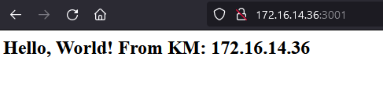
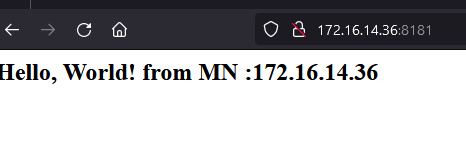
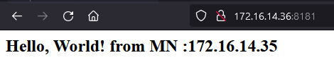
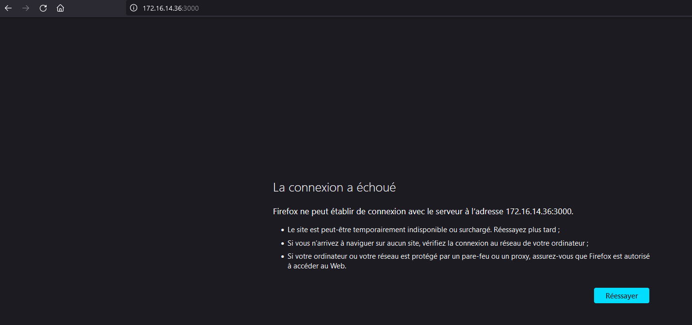

# LABORATOIRE 2
## Deploiement et distribution de charge
- 1 Memebre A crée d'abord un environnement virtuel sur sa machine et install flask dedans 
```bash
    python -m venv 6gei311-labo2
    .\scripts\activate 
    python -m pip install flask
```
- 2 et 3 Membre A crée un fichier et y met le code 
```python
   import socket
    from flask import Flask
    app = Flask(__name__)

    @app.route('/')
    def hello_world():
        return "<h2> Hello, World! from MN :"+socket.gethostbyname(socket.gethostname())+"</h2>"

    if __name__ == '__main__':
        app.run(host='0.0.0.0', port = 3000, debug = True)
```
- 4 et 5 Execution du code python


- 6 on remarque sans serveur ca ne marche plus 

- 7 On éxécute notre code python encore 

- 8 Membre A doit partager son code avec Membre B en utilisant github.
```bash
   pip freeze > requirements.txt
   git init
   git remote add origin https://github.com/Duke200010/6gei311-labo2
   git add *
   git commit -m "Envoi de mon application Mayatta"
   git push --set-upstream origin master
```
- 9 Membre B doit créer une copie locale du code du Membre A dans sa propre machine
```bash
   git clone https://github.com/killianmarty/Labo2_architecture_logicielle_killian_marty
```
- 10 Membre A doit télécharger le serveur nginx et le lancer comme indiquer dans ce lien
```bash
   start nginx
```
- 11  Membre B doit ouvrir le code du membre A, et faire deux changements

        a. Changer l’adresse ip dans la fonction hello_world (sans changer les initials), la nouvelle valeur doit être l’adresse IP de la machine du membre B. Ce changement nous permettra de distinguer pour chaque requête vers chaque application, quelle serait la machine qui nous répond. Ce changement est nécessaire pour les expérimentations qu’on fait dans le laboratoire, mais ce genre de différence n’existe pas entre les composantes utilisées dans des systèmes de la vie réelle.
        b. Change le port dans app.run de 3000 à 3001. Ce changement est nécessaire pour pouvoir exécuter les deux applications sur la même machine. 
```python       
    from flask import Flask
    import socket
    app = Flask(__name__)

    @app.route('/')
    def hello_world():
        return "<h2>Hello, World! From KM: " + socket.gethostbyname(socket.gethostname()) + "</h2>"

    if(__name__ == '__main__'):
        app.run(host='0.0.0.0', port=3001, debug=True)
```
- 12 Membre B doit lancer l’application du membre A sur sa machine.


- 13 Les deux membres doivent s’assurer que les deux applications sont démarrées correctement sur leurs machines en allumant les deux serveurs.

- 14  et 15 Les deux membres doivent s’assurer que les deux applications sont démarrées correctement sur leurs machines.
```conf
   http {
    include       mime.types;
    default_type  application/octet-stream;

    #log_format  main  '$remote_addr - $remote_user [$time_local] "$request" '
    #                  '$status $body_bytes_sent "$http_referer" '
    #                  '"$http_user_agent" "$http_x_forwarded_for"';

    #access_log  logs/access.log  main;

    sendfile        on;
    #tcp_nopush     on;

    #keepalive_timeout  0;
    keepalive_timeout  65;

    #gzip  on;
    upstream labcluster {

      server 172.16.14.36:3000;
      server 172.16.14.35:3001;

    }
    server {
      listen 8181 default_server;
      #listen [::]:8181 default_server;
      #root /var/www/html;
      #server_name _;

      location / {
        proxy_pass http://labcluster;
        try_files $uri $uri/ =404;
      }


      #location /labapp {
       # proxy_pass http://labcluster/labapp;
      #}
      

}
```
- 16  Ouvrez le navigateur sur une machine quelconque, et naviguez vers l’adresse : http://IP_MEMBRE_A:8181/, faites des refresh plusieurs fois, qu’est-ce que vous remarquez?

    On remarque que notre distributeur de charge nginx nous dirige tantôt dans mon serveur local tantôt dans mon serveur dans le membre B

     
    

- 17 Arrêtez l’application du membre A sur la machine du membre A, est ce que l’application est toujours accessible via
 a. http://IP_MACHINE_A:3000/ ?


    On remarque que notre code ne s'affiche plus sur le serveur sprés l'avoir éteint 
     

     b. http://IP_MEMBRE_A:8181/ ?
     
     On remarque que mon code s'affiche mais seulement avec mon adresse IP qui est dans la machine du membre B car mon serveur local est éteint

      

- Annexe 
    On a créer un .gitignore ou on a mis nos fichiers qu'on voulait pas transmettre en faisant un push de notre repository 